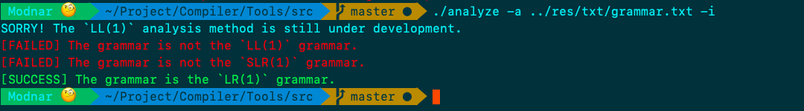

# GrammarParserTools

## 目录

- [简介](#简介)
- [用法说明](#用法说明)
- [安装](#安装)
- [声明](#声明)

## 简介

&#160; &#160; &#160; &#160; `GrammarParserTools`是一个文法解析工具，用此工具来判断输入文法是否符合某种编译文法解析类型。

&#160; &#160; &#160; &#160; 目前支持判断的类型有`SLR(1)`和`LR(1)`类型两种。

## 用法说明

&#160; &#160; &#160; &#160; 使用编译后生成的目标文件`analyze`来检查你的文法。

&#160; &#160; &#160; &#160; 你可以这样使用：

```bash
$ ./analyze -a ../res/txt/grammar.txt -i
```

&#160; &#160; &#160; &#160; 用此命令来检查grammar.txt是否符合`LL(1)`、`SLR(1)`和`LR(1)`文法定义。

&#160; &#160; &#160; &#160; 运行结果展示：



&#160; &#160; &#160; &#160; 命令参数说明：

``` 
Usage: $ analyze -[option argv] [-i]
```

- `-option argv`: 必要参数，指定检查范围，可选值包括`-l`、`-s`、`-r`、`-a`和`-n`。这里的必要是指程序必须指定option包含`-l`、`-s`、`-r`、`-a`中的一种，并提供相应的文件路径，以确保程序功能的执行。

    - `-a`: 是指包括所有可能的选项，

    - `-l`: 指定使用`LL(1)`分析法来分析语法源文件（argv对应于待检查文法文件路径）；

    - `-s`: 指定使用`SLR(1)`分析法来分析语法源文件（argv对应于待检查文法文件路径）；

    - `-r`: 指定使用`LR(1)`分析法来分析语法源文件（argv对应于待检查文法文件路径）；

    - `-n`: 可选参数，指定文法中的“空”用什么字符/字符串来表示。例如编译实验中常用的以“$”来作为该标记，为纪念那段实验经历，本程序以“$”作为默认值。当然，你的文法中可能直接使用“empty”来作为“空”标记，只需要加上选项`-n "empty"`即可，就像这样：

```bash
$ ./analyze -a ../res/txt/your_grammar.txt -n "empty"
```

- `-i`: 可选参数，指定程序运行中是否忽略（ignore）细节信息。细节信息主要指当一种文法不符合相应分析方法时，会打印相应的错误出现的位置。

## 安装

&#160; &#160; &#160; &#160; 下载并编译(附赠Makefile)，得到`analyze`可执行文件，将其作为命令行可执行程序并运行即可。当然，你也可以将其移动到`/usr/local/bin/`下(Unix/Linux下且确保你的权限足够)，以使其更加方便使用。

- SSH:

```bash
$ git clone git@github.com:Modnars/Compiler.git
$ cd Compiler/Tools/src/
$ make
```

- HTTPS:

```bash
$ git clone https://github.com/Modnars/Compiler.git
$ cd Compiler/Tools/src/
$ make
```

## 声明

> Copyright (c) 2020 Modnar. All rights reserved.
